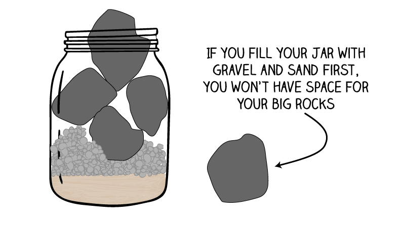

# Time is the ultimate currency

This idea is described in detail by Henry David Thoreau in the first chapter of _Walden_. It pops up in many other places, too. I keep track of some of my favorites.

On [The Gradient podcast in late 2021](https://thegradientpub.substack.com/p/devi-parikh-on-generative-art-and#details), guest Devi Parikh said:

> Caring about something is making sure you prioritize it and do it…if something is falling through the cracks then I don’t care, and if I don’t care then it’s not going to fall through the cracks

Sometime in mid-2022 I was grinding through a Peloton class and Robin Arzón summed it up beautifully:

> Replace "I don't have time" with "that doesn't matter" and see how it sits.

And then of course there's the wildly popular "big rocks first" organization framework. 

## To sum it up

Are you making the time for the things that matter, spending your time wisely? Or are you letting insignificant things pour sand in your jar, eliminating the space needed for the big rocks?

Related: this is why [creative people say no](../creative_people_say_no/).