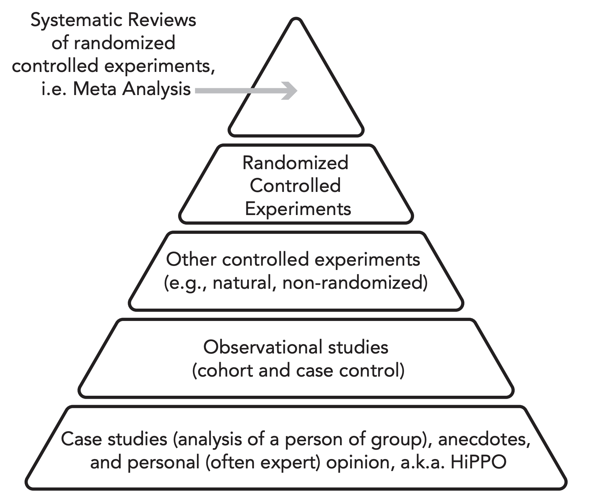

<!--
.. date: 2023-03-25
.. tags: experimentation, technical
-->

# Low-volume experimentation

It's finally here, a technical post! [[1]](#1)

Recently, I've been challenged by running experiments with low data volume. Data science as we know it is built on a foundation of Big DataTM because large volumes of data enable researchers and analysts to explain a large percentage of variation in the metrics they care about. A wide & dense dataset provides more possible explanatory features; a deeper dataset with more observations provides more examples to generate confidence in relationships drawn between features and outcomes.

When you instead have Small Data in front of you, approaching problems like A/B testing [[2]](#2) [[3]](#3) according to well-known best practices can be a real obstacle. This can be particularly challenging when the target metric the experiment [seeks to move](../../pages/snippets/be_hypothesis_driven/) is continuous and high-variance. The business still needs to make a decision, but the data simply isn't large enough to yield significant results. This happens at all sorts of companies for different reasons. 
- In [my current role](emilypastewka.github.io/posts/ml_products_today_tomorrow/) at Black Crow AI, my team works with clickstream data from hundreds of companies, but often we want to learn about the impact an algorithmic intervention has on customers of a single company, and some of those companies have traffic volume as low as a few thousand users per day.
- At Rent the Runway, data on a huge percentage of our customers stretched back years and was denser even than the data I worked with at Uber, but during the depths of covid few were active on a regular basis.
- In my first role at Uber, I ran experiments on our customer support process that aimed to improve both customer happiness and process efficiency. The experiments impacted millions of riders and drivers worldwide, but only a few hundred customer support agents.

**How can data analysts and scientists confidently guide business decisions when large-volume experimentation is impossible?**

Let's start by clarifying the exact problem we face in such scenarios. When setting up a hypothesis test with a continuous outcome variable and intending to apply frequentist measurement methods [[4]](#4), we first declare a null hypothesis that some "treatment" or intervention will have absolutely no impact on that metric. We then expose a random sample of the population to the baseline or "control" experience and expose a separate random sample of the population to a treatment experience. We measure the average value of the target metric for both the treatment and control groups and then find the probability of measuring that difference conditional on our assumption of the null hypothesis, i.e. _given we believe that the metric values will be identical, and given the experiment parameters, what is the probability of measuring a difference in metric value of the treatment and control groups as extreme as we have?_ If said probability is sufficiently low, we declare that we are confident that the results are statistically significant and thus we reject the null hypothesis.  

The parameters of such an experiment are as follows:
- $N$ = sample size, the size of the population in the experiment (treatment and control groups). When we run an experiment with low data volume, the phrase we use is "low sample size."
- $\mu$  = the mean value of the target metric in the control group (standing in for the mean value of the target metric for the full population without treatment)
- $\bar{x}$ = the mean value of the target metric in the treatment group
- $\sigma = \frac{\sum{(x_{i} - \mu)}^2}{N}$ = the standard deviation of the target metric across the full population, measured over a time period prior to the start of the experiment
- $Z = \frac{\bar{x} - \mu}{\frac{\sigma}{\sqrt{n}}}$ = a commonly used test statistic, when $\sigma$ is known and $N>30$. It tells us the number of standard deviations that a sample mean deviates from the population mean in a standard normal distribution.
- $\alpha$ = significance level. We set $\alpha$ at a specific level to control the Type 1 error rate, or the probability of erroneously rejecting null hypothesis when it is correct. A higher value of $\alpha$ denotes a greater willingness to incorrectly reject the null hypothesis when it is true.
- $\beta$ = the experiment's power. We set $\beta$ to a specific level to control the probability of encountering a Type 2 error, i.e. failing to reject an incorrect null hypothesis and missing a true impact. A higher value of $\beta$ denotes a greater willingness to accept the null hypothesis when it is untrue. 
- $p$ = "p value," the probability of observing a test statistic at least as large as we have, conditional on our null hypothesis that there is no actual difference between the treatment and control metrics. If $p < \alpha$, we say the results of our experiment are statistically significant at a level of $1-\alpha$. 

We can clearly see that a lower value of $N$ implies a larger $\sigma$ and a larger denominator in the $Z$ statistic equation, thus a smaller $Z$ statistic and a lower probability that any difference we measured between treatment and control metric values is statistically significant. We can also see that increasing $\alpha$ or $\beta$ increases the likelihood of achieving statistically significant results, but at the cost of increasing the risk of accepting erroneous results. Both $\alpha$ and $\beta$ should be fixed in advance subject to the needs of the business, as should the threshold for practical significance (also called "minimum detectable effect"). These parameters are then used to find the minimum value of $N$ required to run an experiment that will generate valid results ([example](https://www.evanmiller.org/ab-testing/sample-size.html)).

There is plenty of literature on how to handle the low sample size problem [[5]](#5), but different industries and situations call for different approaches, meaning each post or paper I've encountered has typically covered just 1 or 2 concepts. In addition, some advice I've read is statistically valid but practically downright silly. I'll ignore basic guidance like "stick to two variations" and "aim for a high-impact treatment" and "don't make mistakes setting it up;" instead I'll summarize the range of approaches I've found truly useful over the past decade.

### 0 Run the experiment for a longer period of time
I don't use the number zero here because I'm a dogmatic computer scientist, but rather because this bucket of suggestions has practically zero value. 

Let's ignore practicality for a second. The logic behind this suggestion is the idea that running the experiment for a longer period of time will yield a greater volume of observations, i.e. higher sample size ($N$). The problem we identified with low sample size disappears!

Practically, however, this isn't often a solution to the problem. For starters, $N$ often increases sublinearly with time. Consider for example running an experiment on a population of website visitors. When the experiment begins, we bucket each visitor who arrives into treatment or control. When a visitor arrives a second time (or third, etc), they are not re-bucketed and their new visit doesn't increase our sample size. The cumultive $N$ defines the number of _unique_ visitors, so if we see $n$ visitors per week and the visitor return rate is $x$, we add $n$ visitors in week 1 and then $n(1-x)^t$ visitors for each week $t$ thereafter. There is a decreasing return on investment with time.

In addition to the decreasing rate of population gain, the longer period of time [introduces risk](https://exp-platform.com/Documents/2016%20IEEEBigDataLongRunningControlledExperiments.pdf) to the validity of the experiment. While we always want to run an experiment [long enough to avoid novelty effects and seasonality](https://statsig.com/blog/reading-experimentation-tea-leaves), running the experiment for too long increases the probability of leakage (a user being exposed to both treatment and control) and may prohibit us from running other experiments that seek to move the same metric for the same population [[6]](#6).

## 1 Variance reduction
The first place I look when aiming to derive meaningful results from an experiment run with a relatively low volume of data is at my target metrics: can I [reduce their variance](https://exp-platform.com/Documents/2015-08OnlineControlledExperimentsKDDKeynoteNR.pdf)? Recall the equation for the test statistic: when $\sigma$ is lower, $Z$ is higher. 

A great [post](https://craft.faire.com/how-to-speed-up-your-a-b-test-outlier-capping-and-cuped-8c9df21c76b) from the data team at Faire covers several useful approaches for variance reduction, including removing outliers and leveraging [CUPED](https://exp-platform.com/Documents/2013-02-CUPED-ImprovingSensitivityOfControlledExperiments.pdf) (which DoorDash extends using maching learning to [CUPAC](https://doordash.engineering/2020/06/08/improving-experimental-power-through-control-using-predictions-as-covariate-cupac/)).

<!-- Conflicting info on whether converting metrics to binary also reduces their variance: https://statisticsbyjim.com/hypothesis-testing/comparing-hypothesis-tests-data-types/ https://exp-platform.com/Documents/2015-08OnlineControlledExperimentsKDDKeynoteNR.pdf -->

## 2 Proxy metrics
If it's impossible to adequately reduce the variance of the target metric, the next approach I look to is finding a more stable proxy metric to measure in place of or in addition to my target metric. 

In addition to being more stable than the target metric, a good proxy metric will, well, adequately proxy the target. You want to be confident that you can use findings about the proxy metric to [understand](https://statsig.com/blog/picking-metrics-101) the impact on the target metric. A good proxy metric will therefore have a logical relationship and and be highly correlated with the target metric, either in real-time or as a leading indicator [[7]](#7). You may find such a metric by [contextualizing](https://www.geteppo.com/blog/experimentation-metrics-deciding-what-to-measure) your metric in a funnel framework and choosing the metric that measures the step immediately before or after, by looking for features that are [predictive](https://www.geteppo.com/blog/reducing-experiment-durations) of your target, or by building a low-bias, low-variance model trained to predict your metric and using the resulting prediction as your proxy. More than one proxy metric may be useful —just don't go p-hunting! Too many target variable will necessitate an adjustment to your methodology to avoid the multiple comparison problem.

## 3 Replication
Here's where we start getting outside the usual set of recommendations you'll run into in standard tech spaces. Meta-analysis as a category sits a level above individual experiments on the [hierarchy of evidence-based research](https://www.researchgate.net/figure/The-hierarchy-of-evidence-From-Trisha-Greenhalgh-How-to-Read-a-Paper-The-Basics-of_fig2_366516908), but replication requires running your experiment multiple times, which is often not possible. We want to move fast, after all. But [replication is an extremely powerful approach](https://www.isixsigma.com/dictionary/replication/) to increasing (or refuting!) confidence in experimental results, particularly results from underpowered experiments. If we have access to multiple populations, we can replicate experiment results without increasing experiment duration by running multiple instances of the same experiment [[8]](#8).

Why is replication so powerful? Consider once again the statistics backing experimental analysis: we compute the probability of measuring a result as extreme as our finding given belief in the null hypothesis, and compare that probability to the desired significance threshold $\alpha$. If our populations and the experiments we run on them are entirely independent, we can take advantage of the definition of joint probability for independent events: $p(A ∩ B) = p(A) * p(B)$. Let's say we measure two independent experiments and find $p = 0.05$ for both. The joint probability of this combined finding is  $0.025$, lower than the individual probability of either finding, and therefore more likely to be lower than $\alpha$. This logic extends as we add experiments. In practice, this means we run each individual experiment with a low sample size and still expect to be able to measure combined results against a strict $\alpha$ value. 

The underlying assumption of independence here is critical. In reality, leakage across populations is often possible, and the math becomes a lot more [complex](https://stats.stackexchange.com/questions/539419/confusion-about-joint-probability) when the assumption of independence is violated. Consider, for instance, the way we've applied replication at Black Crow AI: we set up experiments to measure the impact of the same intervention on the user base of many different DTC brands. Each experiment is configured on a different website. A single user, however, may be a customer of multiple brands. We can measure this overlap to some degree and apply different equations for joint probability based on these measurements, but the true overlap is not completely known. We therefore don't drop our minimum per-experiment confidence threshold below 80%, ensuring that we have reasonable faith in the results of each individual experiment in addition to the conclusion we draw from meta-analysis across the set of replicated experiments [[9]](#9).

In some cases, we may also have the option to combine the multiple populations to which we have access and then run the experiment on the combined group. This increases sample size, but it also risks [Simpson's paradox](https://plato.stanford.edu/entries/paradox-simpson/#:~:text=Simpson's%20Paradox%20is%20a%20statistical,population%20is%20divided%20into%20subpopulations.): the different populations from which we sample may respond similarly to the treatment, but the underlying differences in data across the groups may lead to measuring the opposite effect. 

*Source: Diane Tang, Ron Kohavi, and Ya Xu's incredibly helpful text [Trustworthy Online Controlled Experiments](https://experimentguide.com/). The image is adapted from Trisha Greenhalgh's 2014 paper [How to Read a Paper](https://www.researchgate.net/figure/The-hierarchy-of-evidence-From-Trisha-Greenhalgh-How-to-Read-a-Paper-The-Basics-of_fig2_366516908).*

## 4 Triangulation
In tech, it sometimes seems that A/B testing is the only way to learn about the impact of an intervention. And yes, in the hierarchy of evidence-based methods, experimentation is near the top. But other methods exist! I'm not recommending pursuing lesser methods of analysis in place of experimentation, but rather building on the idea of replication: even if you can't run your experiment many times, you can combine findings from your experiment along with results from other approaches to [triangulate](https://www.unaids.org/sites/default/files/sub_landing/files/10_4-Intro-to-triangulation-MEF.pdf) the true impact of an intervention. An underpowered experiment may yield statistically or practically insignificant results that are nevertheless directionally interesting. Additional analyses can bring confidence to — or refute! — such findings.

The best supporting method(s) to leverage will differ depending on the scenario, but in general the goal is to move down the hierarchy of evidence as little as possible. [Quasi-experimental](https://netflixtechblog.com/quasi-experimentation-at-netflix-566b57d2e362) methods such as [differences-in-differences](https://dimewiki.worldbank.org/Difference-in-Differences#:~:text=The%20difference%2Din%2Ddifferences%20method,useful%20tool%20for%20data%20analysis.), [uplift models](https://www.uplift-modeling.com/en/latest/user_guide/introduction/cate.html) (also called [instrumental variables](https://dimewiki.worldbank.org/Instrumental_Variables)), and [synthetic controls](https://www.youtube.com/watch?v=j5DoJV5S2Ao) (or [propensity matching](https://dimewiki.worldbank.org/Matching)) are several options I have employed. 

**Conclusion**

It can be tempting to throw up your hands when confronted with low sample size. As modern data practitioners, we have been trained that an A/B test at 95% confidence is the One Method to Rule Them All. But the real world is [messy](../../pages/snippets/life_is_curve_balls/), and our stakeholders will make decisions with or without [our input](../../pages/snippets/be_an_owner/). Data-driven guidance is always preferable to ¯\\_(ツ)_/¯. 

Don't be afraid to get creative with your measurement approach. Do properly contextualize your findings for your stakeholders based on whatever approach you take.

Go forth and learn things!

---

#### [1] 
I find people problems at least as [complex](../../pages/snippets/i_contain_multitudes/), challenging, and rewarding to solve as data problems, but more than a few people have asked me to write about data science in addition to [building data teams](../../pages/snippets/build_teams_of_t_shapes/). You know who you are, and this one's for you.

#### [2] 
I'll use the terms "experiment," "A/B test" and "hypothesis test" interchangeably throughout this post.

#### [3] 
And many others — for instance, building machine learning models, which has also been a pain in my rear recently — but that's another post.

#### [4] 
Sample size matters for Bayesian measurement, too, but I am not going to open the Bayesian vs. Frequentist debate here. Each has its own pros and cons worth understanding.

#### [5]
Thankfully, the field of statistics and concepts of hypothesis testing have been around a lot longer than data science. Before Big Data gave us modern A/B testing, randomized controlled trials (RCTs) covered the same ground. In fact, when I worked at Opower, we still used the language of RCTs to convince energy regulators that the behavioral science driven energy savings we generated and measured were reliable. It appears that may [still](https://docs.oracle.com/en/industries/energy-water/opower-platform/data-extracts/emv_extract/Introduction-EMV-RCT.htm) be true?

#### [6] 
As important as this is, I found myself hesitating to include it because so often in my career I have enountered well-meaning individuals hesitant to run any two experiments at the same time on the same population, worried about losing the ability to measure reliable results. Typically, this is [not a concern](https://statsig.com/blog/embracing-overlapping-a-b-tests-and-the-danger-of-isolating-experiments)! Even when aiming to move the same metric, you can often get away with running overlapping experiments with no problem at all, as long as you separately randomize the population into treatment and control. An issue arises _only_ when the set of experiments in consideration may interact or interfere with one another, thereby amplifying or dampening the combined results. Treatments with no logical interactivity are typically fine. Of course, human psychology is tricky — we can't always guess at exactly which treatments will interact — but we can draw on logic and past experience to do a reasonably good job.

#### [7] 
Finding a proxy metric that is a leading indicator of your target metric can be particularly valuable when you are trying to impact a metric that moves slowly, like retention. 

#### [8] 
This is why we see so much news about the "replication crisis" in research — inability to replicate results is _damning_. 

#### [9] 
80% is just the choice we made based on our needs, not a best practice or recommendation. 
