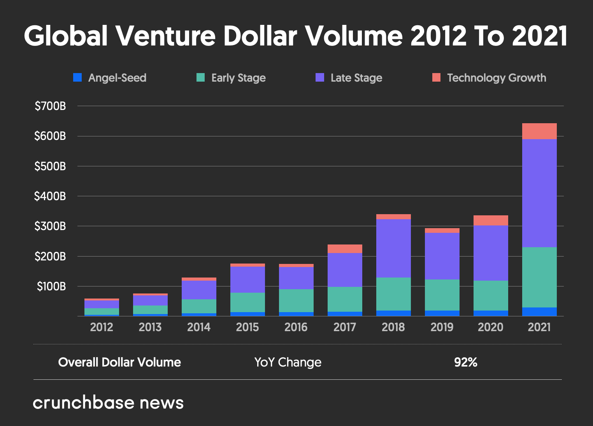

# Building ML products today vs. tomorrow, and what it means for me

## Today
Over the last few years of leading Machine Learning and Data Engineering at Rent the Runway, I've spent a lot of time trying to understand and plan for trends in the broader industry. Choosing the right projects to work on, hiring a flexible team who could handle the challenges coming our way, all required an informed perspective on cutting edge technology and other companies' approaches to leveraging it.

Over time, I came to believe something that was, at first, jarring: I don't think the jobs I've had over the last decade will exist in another 10 years.

It’s hard to write that down. Creating bespoke data products has been an outlet for creativity and innovation, a source of joy, inspiration, and pride. The opportunity to do these things is what brings many brilliant minds into the field. But it’s becoming, to a degree, unnecessary and unsustainable. Though more and more people are being trained in the field, making it easier to find and hire the talent needed to build your applications, the need to take this approach is drying up.

Earlier this year I started maintaining a spreadsheet listing every data product I’d considered that might benefit our business. That left-most column contains everything from recommender systems to chatbots, transportation optimization, forecasts of various business metrics, entity extraction, computer vision-based warehouse automations, and more.

In the next column, I note whether the product was core to our business, such that owning the logic so critical that we’d never consider outsourcing. In some cases, the answer is "yes," implying that being great at this task is tightly coupled with being a great company. Examples: Google search ranking, Uber matching (related: [work where your company makes money](../../pages/snippets/where_does_your_company_make_money/)). In the third column: does this data product depend on data we’re entirely unwilling to share? Some proprietary data is too valuable to sign over to certain contractors, depending on the terms. Together, these two columns determine if we should maintain the work in-house [[1]](#1) or consider outsourcing. Many potential projects appear to be good candidates by these standards. 

The next several columns help me determine whether outsourcing is actually possible today. Does the idea described already exist as a (reputable, high-performance) product? Will the vendor allow us to tailor/customize specific components as-needed? Does the pricing make sense?

Outsourcing feels expensive at first, and to be honest, we're in a bit of a strange period right now where it still can be more expensive than I believe it will come to be over time. Too many early MLaaS companies are built around a single data product, or very small number of them, requiring a leader like me to consider dozens of integrations to achieve all of her goals. And most potential customer companies more than a few years old weren't built with a tech infrastructure that makes integrating ML products straightforward. That implies that outsourcing isn't so much reducing the burden of developing a data product as shifting the cost to another team. But it's something teams will get better at. It's something vendors will get better at. And we will inevitably see vendor consolidation. 

## Tomorrow

In a [TWIML AI Podcast episode](https://twimlai.com/podcast/twimlai/applied-ai-ml-research-at-paypal-with-vidyut-naware/) earlier this year, Vidyut Naware, who works on Applied AI/ML Research at PayPal, discusses the way he thinks about the 4 layers of AI R&D: hardware, algorithms, application, and tooling ecosystem. 

Hardware and algorithm research are foundational, and not particularly easy to break into. Since unlocking the modern age of deep learning, NVIDIA's GPUs have continued to [dominate](https://www.stateof.ai/) in this industry (though challengers have begun to receive [plenty of funding](https://techcrunch.com/tag/ai-chips/)). Algorithm research also tends to come from predictable, well-funded sources — DeepMind, Google Brain, OpenAI, and FAIR especially. 

On the other end of the spectrum, innovation in tooling seems to be more closely to connected to application of AI. A large number of startups are built around formerly in-house systems and frameworks spinning out into independent businesses [[2]](#2). Today's "modern data stack" means one thing, but data leaders are evaluating new additions to their tooling ecosystems constantly, with a firm sense that each component must be easily replaceable due to the rapid evolution we're seeing.

Arguably, application research has been taking place the longest, and yet we've seen the greatest benefits remain in-house. It has taken time for the problem spaces and solutions to be well enough understood to productize, and for the trust to evolve and create demand. On top of that, application research has been moving so quickly (keeping up with the rapid improvements in hardware, tooling, and underlying algorithms) that building a business on top of an existing solution might have felt like signing up for a Sisyphean task of constant upgrades. Yes, great companies do this anyway, but the pace has to be sustainable. When I look at the recent spate of startups being funded for a thin wrapper around a specific diffusion model or LLM, I worry that many will be left in the dust in the blink of an eye.

Ecommerce, on the other hand, is not brand new, nor are many of the ML products powering these businesses. At Rent the Runway, I focused a lot of time on learning from other innovative tech companies, from subscription-based "access over ownership companies," but I also spent a lot of time learning from more traditional brands and retailers. The last few years in this space have been particularly exciting, as COVID led to an explosion in ecommerce, which in turn led to an explosion in VC investment for startups catering to online sellers [[3]](#3). For the first time in my career, I found myself spending as much time writing business cases for what my teams should as buy as what they should build. 

## What it means for me

This was a big change, and change brings opportunity. I found I'm quite good at and very much enjoy leading cross-functional vendor sourcing and integration. It opened my eyes to how many more sides of this industry might interest me outside of in-house development.

At the same time, I began to feel that this is a point in my life where I'm uniquely open to risk. I started to feel around the space for opportunities to learn more, faster — maximum discomfort. I found myself especially excited about roles that would ask me to keep my eye on the larger industry — tracking big trends and shifts like those I discussed above and and determining how different companies need to shift their approach to successfully navigate them. For the first time since 2012, consulting and similar roles began to interest me once again [[4]](#4). I especially loved that more older firms tend to seek such engagements, which would give me opportunities to untangle particularly challenging problems, bridging gaps covering potentially decades of technological innovation. On the complete other end of the spectrum, I was excited about SaaS startups building the types of tools and applications I saw enabling great data teams like mine. Serving B2B clients would still require me to dig into many companies' use of data to be successful, and having never worked outside of late-stage venture-funded (I've joined Series C-F exclusively), I knew the challenge of an earlier-stage company would be exciting. 

In a perfect world, I could do both at the same time (and keep my Rent the Runway job, and finish writing a novel, and...), but [life is tradeoffs](../../pages/snippets/life_is_tradeoffs/). I chose the startup [[5]](#5).
- There are a lot of reasons [why it's good to work at an early stage startup](https://www.entrepreneur.com/starting-a-business/why-everyone-should-work-for-a-startup-at-least-once/386165) generally. Getting comfortable with uncertainty feels especially valuable in today's world of [constant curve balls](../../pages/snippets/life_is_curve_balls/).
- For me specifically, there was the added bonus of getting to shrink my [job matrix](../../pages/snippets/view_your_job_as_a_matrix/) and dig back in on technical skills for a time. [Engineering leaders do their jobs better when their technical skills remain relevant](../../pages/snippets/engineering_leaders_do_their_jobs_better_when_their_technical_skills_remain_relevant/). 
- In September, I got a call from a recruiter about a company at the nexus of all these big ideas I'd been thinking about. I became excited about this company *specifically*.

As of this month, I've started a new chapter at [Black Crow AI](https://www.blackcrow.ai/about).  My team spans all things data, including the core components of MLaaS solutions we sell to hundreds of customers ([callback!](../../pages/snippets/where_does_your_company_make_money/)). Some of those solutions will feel familiar to me from my work at Uber and Rent the Runway, balancing out the unfamiliarity of going from 0 to 100 with a Series A company. And I'm going to be working with great people who are excited about the same things I am — democratizing AI access, building great products with cutting edge technology, and constantly learning. 

I'm not going to lie, I'm a little bit scared. But that was the goal. *Here we go!*

___

#### [1]
Note that “should we do it” <> “should we do it now.” While in theory taking on every NPV-positive project is the path to maximizing a company's profits ([the NPV rule](https://www.investopedia.com/terms/n/npv-rule.asp#:~:text=The%20net%20present%20value%20rule%20is%20the%20idea%20that%20company,of%20net%20present%20value%20theory.)), in practice constraints exist: how big is the team, and how quickly can you grow it? On top of this evergreen constraint is the current tanking [belief rate](https://www.notboring.co/p/discounting-belief). Companies ([including RTR](https://www.retaildive.com/news/rent-the-runway-layoffs-corporate-employees/631683/)) are tightening their belts in the face of economic uncertainty rather than making bets, even good ones.

#### [2]
The Data Engineering podcast hosted a [nice discussion](https://www.dataengineeringpodcast.com/airbnb-alumni-data-driven-organization-episode-319/) recently about the 100+ startups that have come out of Airbnb, for example.

#### [3]

> Global venture investment in 2021 was more than tenfold that of 2012.

-- [CB News](https://news.crunchbase.com/business/global-vc-funding-unicorns-2021-monthly-recap/)

#### [4]
I began working at a boutique environmental consulting firm after graduating and quickly came to realize that I was much more excited to build things on my own than to tell other people how to do so. I felt terrible leaving after just 4 short months, but the move to Opower was a no-brainer.

#### [5]
And actually, I am free to remain open to ad-hoc consulting engagements, which I still enjoy. 
